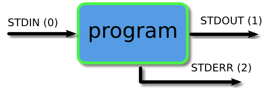

## 管道和重定向！

在前两节中，我们查看了一系列可以为我们操作数据的过滤器。在本节中，我们将看到我们如何将它们连接在一起以进行更强大的数据操作。

本节中涉及一些阅读。即使机制及其使用非常简单，如果你希望有效地使用它们，了解其行为的各种特征也很重要。

## 那他们是什么？

我们在命令行上运行的每个程序都会自动连接三个数据流。

* STDIN（0） - 标准输入（输入程序的数据）
* STDOUT（1） - 标准输出（程序打印的数据，默认为终端）
* STDERR（2） - 标准错误（对于错误消息，也默认为终端）



管道和重定向是我们可以在程序和文件之间连接这些流以便以有趣和有用的方式引导数据的手段。

我们将通过几个示例演示下面的管道和重定向，但这些机制将适用于命令行上的每个程序，而不仅仅是我们在示例中使用的程序。

## 重定向到文件

通常情况下，我们会在屏幕上显示输出，这在大多数情况下都很方便，但有时我们可能希望将其保存到文件中以保存为记录，输入另一个系统或发送给其他人。大于运算符（>）向命令行指示我们希望程序输出（或发送到 STDOUT 的任何内容）保存在文件中而不是打印到屏幕上。我们来看一个例子吧。

```bash

```

## 观察

你会注意到，在上面的示例中，保存在文件中的输出是每行一个文件，而不是在打印到屏幕时跨越一行的所有文件。原因是屏幕是已知宽度，程序可以格式化其输出以适应这种情况。当我们重定向时，它可能是一个文件，或者它可能在其他地方，所以最安全的选择是将其格式化为每行一个条目。这也使我们可以在以后更轻松地操作该数据，因为我们将在页面下方看到更多内容。

>管道和重定向时，实际数据将始终相同，但该数据的格式可能与通常打印到屏幕的数据略有不同。记住这一点。

你还会注意到我们创建的用于保存数据的文件也在我们的列表中。机制的工作方式，首先创建文件（如果它已经不存在），然后运行程序并将输出保存到文件中。

### 保存到现有文件

如果我们重定向到不存在的文件，它将自动为我们创建。但是，如果我们保存到已经存在的文件中，那么它的内容将被清除，然后新的输出保存到它。

```bash

```

我们可以使用 double 大于运算符（>>）将新数据附加到文件中。

```bash

```

## 从文件重定向

如果我们使用小于运算符（<），那么我们可以用另一种方式发送数据。我们将从文件中读取数据并通过它的 STDIN 流将其提供给程序。

```bash

```

很多程序（正如我们在前面部分中看到的）允许我们提供一个文件作为命令行参数，它将读取和处理该文件的内容。鉴于此，你可能会问为什么我们需要使用此运算符。上面的例子说明了一个微妙但有用的区别。你会注意到，当我们运行 wc 提供要作为命令行参数处理的文件时，程序的输出包括已处理文件的名称。当我们运行它时，它将文件的内容重定向到 wc，不会打印文件名。这是因为每当我们使用重定向或管道时，数据都是匿名发送的。因此，在上面的示例中，wc 收到了一些要处理的内容，但它不知道它来自何处，因此它可能无法打印此信息。结果是，

我们可以很容易地将目前为止看到的两种重定向形式组合成一个命令，如下例所示。

```bash

```

## 重定向 STDERR

现在让我们看一下标准错误或 STDERR 的第三个流。这三个流实际上有与之关联的数字（在页面顶部的列表中的括号中）。STDERR 是 2 号流，我们可以使用这些数字来识别流。如果我们在》运算符之前放置一个数字，那么它将重定向该流（如果我们不使用数字，就像我们到目前为止一样，那么它默认为流 1）。

```bash

```

也许我们希望将正常输出和错误消息保存到单个文件中。这可以通过将 STDERR 流重定向到 STDOUT 流并将 STDOUT 重定向到文件来完成。我们首先重定向到文件，然后重定向错误流。我们通过在流编号前面放置一个＆来识别重定向到流（否则它将重定向到名为 1 的文件）。

```bash

```

## 管道

到目前为止，我们已经处理过与文件之间的数据发送。现在我们来看一下将数据从一个程序发送到另一个程序的机制。它叫做管道，我们使用的运算符是（|）（位于大多数键盘上的反斜杠（\）键上方）。该操作符的作用是将左侧程序的输出作为右侧程序的输入。在下面的示例中，我们将仅列出目录中的前 3 个文件。

```bash

```

我们可以根据需要将尽可能多的程序组合在一起。在下面的示例中，我们将输出传送到 tail，以便只获取第三个文件。

```bash

```

>我们为程序提供的任何命令行参数都必须在该程序的旁边。
>
>我经常发现人们一次又一次地尝试写出他们的管道，并且在某个地方犯了一个错误。然后他们认为这是一点，但实际上这是另一点。他们浪费了大量时间试图修复一个不存在的问题，而没有看到那里存在的问题。如果你逐渐增加管道，那么你就不会陷入这个陷阱。运行第一个程序并确保它提供你期望的输出。然后添加第二个程序并在添加第三个之前再次检查，依此类推。这将为你节省很多挫折感。

你也可以组合管道和重定向。

## 更多例子

下面是一些更多的例子来了解你可以用管道做的各种事情。你可以用管道来实现很多东西，这些只是其中的一小部分。凭借经验和一点创造性思维，我相信你会发现更多使用滚边的方法，让你的生活更轻松。

示例中使用的所有程序都是我们以前见过的程序。我已经使用了一些我们尚未涉及的命令行参数。查找相关的手册页以了解他们的工作。你也可以自己尝试这些命令，逐步构建以准确查看每个步骤的作用。

在这个例子中，我们正在对目录列表进行排序，以便首先列出所有目录。

```bash

```

在这个例子中，我们将程序的输出提供给程序，以便我们可以更容易地查看它。

```bash

```

识别主目录中该组具有写权限的所有文件。

```bash

```

创建每个拥有给定目录中文件的用户的列表，以及他们拥有的文件和目录的数量。

```bash

```

## 摘要

### 学到什么

>
将输出保存到文件。
>>
将输出附加到文件。
<
从文件中读取输入。
2>
重定向错误消息。
|
将一个程序的输出作为输入发送到另一个程序。

### 重要概念

流
你可以在命令行上运行的每个程序都有 3 个流，STDIN，STDOUT 和 STDERR。

## 活动

让我们破坏一些数据：

首先，尝试将各种命令的输出保存到文件中。覆盖文件并附加到它。确保你使用绝对路径和相对路径。
现在看看你是否只能列出目录 / etc 中的第 20 个最后一个文件。
最后，看看你是否可以计算你在主目录中拥有执行权限的文件和目录的数量。
